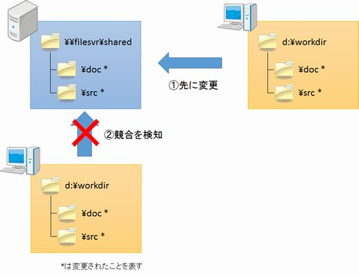

[↑目次](readme.md "目次") | [← 1章 VCSのない世界](1.world-without-vcs.md "VCSのない世界")

# VCSでできること

VCSのない世界で何が起きるかイメージ出来たところで、VCSで何ができるのかを見ていきましょう。

## VCSの力

VCSの能力は、主に次の2つです。

1. 履歴を残す
1. 作業の競合を防ぐ

### 1. 履歴を残す

VCSでできることの一番大きなものは「作業履歴を残すこと」です。これは、言い換えると「誰が」「いつ」「何を」したかが残るということになります。

<table>
  <tr>
    <td>4/14 10:14</td>
    <td>○○機能を追加</td>
    <td>田中一郎</td>
  </tr>
  <tr>
    <td>4/14 09:34</td>
    <td>△△機能のバグを修正</td>
    <td>鈴木花子</td>
  </tr>
  <tr>
    <td>...</td>
    <td>...</td>
    <td>...</td>
  </tr>
</table>

表2-1 履歴のイメージ

なお、この「履歴」を管理する場所を「リポジトリー」と呼びます。また、履歴にはその履歴の内容を表すメッセージを付けることができます。

履歴が残ると何ができるのか。大まかには次の3つができるようになります。

- 参照
- 再現
- 分岐

一つずつ説明していきましょう。

#### (1) 参照

履歴をたどることで、誰がいつ何をやったかを確認することができます。一般的なVCSでは履歴の検索機能もありますので、簡単に対象となる履歴を参照することができます。

VCSのない世界では何が原因でテスト環境が壊れたのか、メンバーの記憶などを頼りにやらざるを得なかった作業が、VCSを使うことで「記憶」ではなく「記録」を元に行うことができるようになります。

また、変更されたファイルを指定して履歴を調べることもできる為、作業効率が大幅にアップします。

#### (2) 再現

VCSを使うと、履歴を参照するだけでなく、その時点の状態を再現することも可能です。つまり、動かなくなったとしても正常に動作していた状態に巻き戻せる、ということです。

この特徴を利用して、動作しなくなる一つ手前に戻り作業をやり直すといったことや、バグが発生する時点の成果物を、他のメンバーに確認してもらう、といったことが可能になります。

#### (3) 分岐

過去の状態を再現した上で、そこから別の変更を加えることで、履歴を分岐することもできます。つまり、複数のアプローチにより、作業を行うことができるということです。

このことから、動作しなくなる手前の状態を元に、よりより変更を加えていき、それぞれのパターンをメンバーに評価してもらうといったこともできるようになります。

### 2. 作業の競合を防ぐ

VCSのもう一つの大きな機能が、「作業の競合を防ぐ」です。VCSを使うことで、誰かが先に変更していればそのことを検知し、VCSが競合箇所を知らせてくれます。

図2-1 競合検知イメージ

VCSのない世界では、同じファイルを複数人で同時に変更すると、後勝ちになってしまいます。すると、前に変更した人の変更内容が失われてしまい、時として動作不良を引き起こします。

しかし、VCSではこういったことは起こらず、誤って他のメンバーの変更内容を消してしまうことがありません。

また、使うVCSによっては、ファイル内の変更箇所を解析し、自動的に自分が行った変更内容と統合（マージ）する機能を持っています。この機能を活用することで、他のメンバーと効率よく並行して作業を進めることができるようになります。

VCSの特徴をつかんだところで、実際にVCSがある世界では、どのように開発が進むのか、次の章でシミュレーションしてみましょう。

[→ 3章 VCSのある世界](3.world-with-vcs.md "VCSのある世界")

----------

