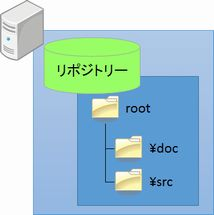
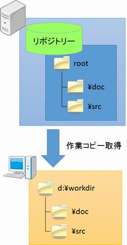
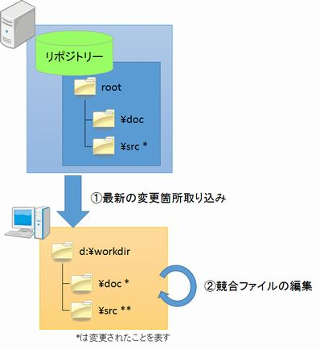
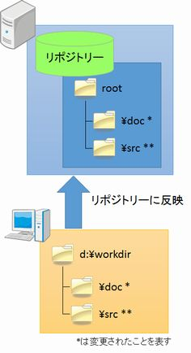

[↑目次](readme.md "目次") | [← 2章 VCSでできること](2.power-of-vcs.md "VCSでできること")

# VCSのある世界

さて、VCSが無いことで痛い目を見た開発プロジェクトが、その後VCSを導入した世界をまた覗いてみましょう。

## 後日
あなたの開発チームは先日の反省を踏まえ、VCSを導入することになり、サーバーにリポジトリが用意されました。

図3-1 リポジトリ

あなたはまず、作業を行う準備として、PC内に作業フォルダーを作成しました。

図3-2 作業フォルダー作成

次に作業対象のファイルの作業コピーを、リポジトリから取得しました。

図3-3 作業コピー取得

あなたは、幾つかの作業コピーのドキュメントやソースを変更し、動作を確認しました。

図3-4 作業コピー編集

作業を終えたので、作業コピーの変更をリポジトリに反映しようとしました。すると、競合が発生したため、反映処理に失敗しました。

図3-5 競合発生

発生した競合についてVCSを使って調べてみました。すると、田中一郎さんが先にリポジトリに反映した変更と競合していることが分かりました。

あなたは早速田中一郎さんと相談し、田中一郎さんの編集した部分を残しつつ、自分の変更を競合したファイルに反映しました。

図3-6 競合ファイルの編集

競合が無くなったところで、改めてリポジトリに変更を反映して無事作業を終えました。

図3-7 リポジトリに反映

## VCSでハッピーに

これまでシミュレーションしてきた話は、いささか恣意的な例であることは否定しません。

しかし、実際の開発現場ではもっと構造が複雑で、対象となるファイルも多く、メンバーも多数であることがほとんどです。こういった環境では、共有フォルダーでの管理は、事実上不可能であるといっても過言ではありません。

そういった複雑な環境でもVCSというツールを使うことで、自分も他のメンバーも、安心して作業を進めることができます。こういった連携を行うためにも、VCSは不可欠なものなのです。

[→ 4章 VCSのみでの限界](4.end-of-world-with-only-vcs.md "VCSのみでの限界")

----------

