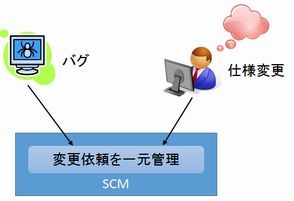
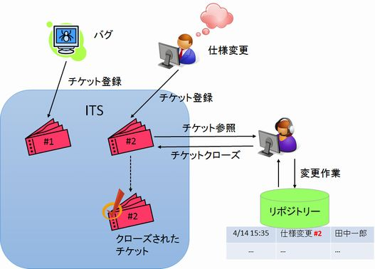

[↑目次](readme.md "目次") | [← 6章 SCMを意識したVCS利用](6.dance-with-scm.md "SCMを意識したVCS利用")

# SCMの次のステップ

VCSだけではサポートできない部分がSCMにはあると説明してきました。では、どんな部分があり、どういったツールでサポートできるのか、その一部を紹介していきましょう。

## 変更依頼の管理

SCMは「変更依頼」の管理も含めてSCMである、と説明してきました。主な変更依頼のトリガーとしては、「バグ」、「仕様変更」等があります。

こういったものは、多くの組織ではそれぞれ「バグ管理票」、「QA票」などで管理されていると思います。しかし、もともとはそれぞれが別文書であるということもあり、「どこからきてどこへ行くのか」追跡がしにくいという問題があります。

このケースへの対応としては、変更依頼のトリガーとなる事象を一元管理する必要があります。ただ、その数は膨大で、とても手書やExcelシートで管理できるものではありません。

図7-1 変更依頼の一元管理

そこで、変更依頼を管理するためのツールの出番です。こういったツールは一般的に「ITS（Issue Tracking System、課題管理システム）」と呼ばれます。

ITSでは、Issue（課題）をTicket（チケット）という単位で登録します。このチケットには一意となる番号（チケット番号）が振られ、担当者を割り当てたり、関連する内容をコメントしたりする機能があり、課題を完了したらチケットを閉じる（クローズ）する決まりになっています。

これにより、今残っている課題、終わった課題、誰が担当しているかなどが明確になり、管理が容易になります。

また、ITSにはVCSと連携する機能があり、チケット番号をメッセージに入れてそのチケットに関連する履歴を参照したり、完了したことを表すメッセージを入れると自動的にチケットをクローズしたり、といったことが可能になります。

こういった機能を活用することで、その変更が何を起点に誰が作業し、今終わっているのかどうか、そして作業履歴がどうなっているかを、一気通貫で追跡できるようになります。

図7-2 チケットのライフサイクル

ただし、これはあくまでツールを正しく活用できた場合であり、どのような粒度でチケットを作成するかや、どうやって膨大なチケットを管理するかといった課題もあります。これらの問題は、導入した組織で試行錯誤を繰り返し、徐々に洗練させていくしかないでしょう。

## 動くソフトウェアの作成

ソフトウェアは動いてこそです。しかし、ソフトウェアを動作させるには、ソースコードからのコンパイル、実行環境への配置、環境設定など、様々な作業が必要です。この一連の作業を「ビルド」と呼びます。

VCSの仕事はバージョン管理です。したがって、そのバージョンに対応した成果物としての「動くソフトウェア」を作ることは出来ません。代わりに成果物を作る役割を担ってくれるのが、ビルドツールです。

ビルドツールにはプラットフォーム毎に色々種類があり、それぞれの専用の構文で書かれたビルドスクリプトを実行することで、ビルド作業を行います。

また、VCSと連携してリポジトリーに変更が反映されたタイミングや、決められたスケジュールでビルドツールの実行を行うツールもあり、これらは自動ビルドツールと呼ばれます。

このビルドツール、自動ビルドツールを活用することで、VCSの履歴に対応したバージョンの動くソフトウェアを、随時作成することができます。これにより、テストを行う際、今動かしているソフトウェアのバージョンが何であり、どんな変更が加えられたものかを追跡することが可能になります。

図7-3 ビルドプロセスイメージ

----------

